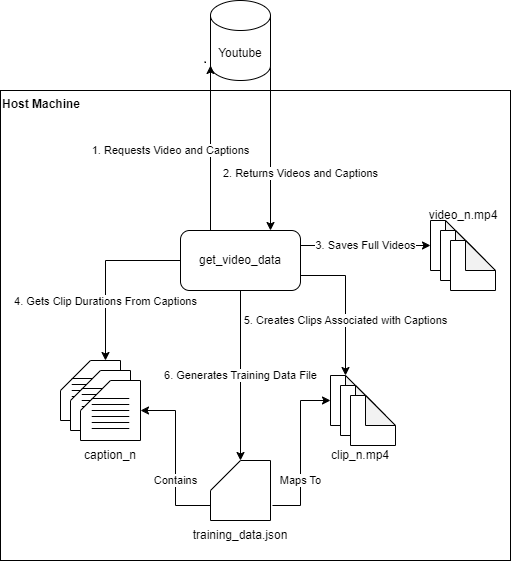
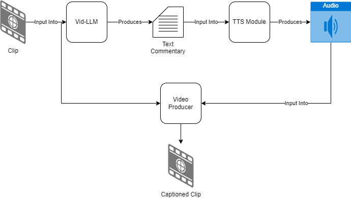
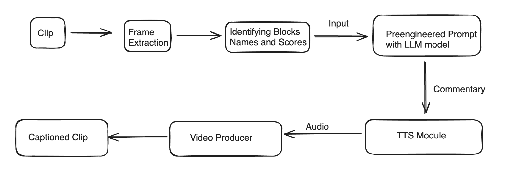
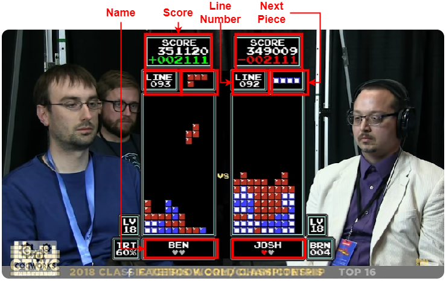
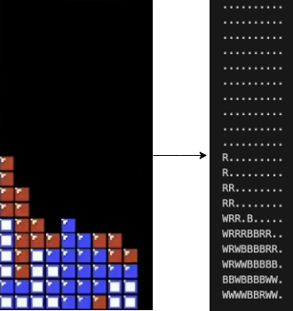
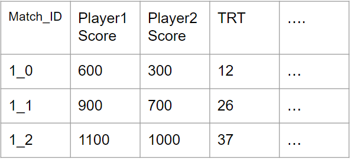
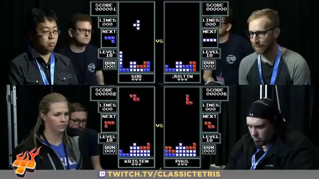
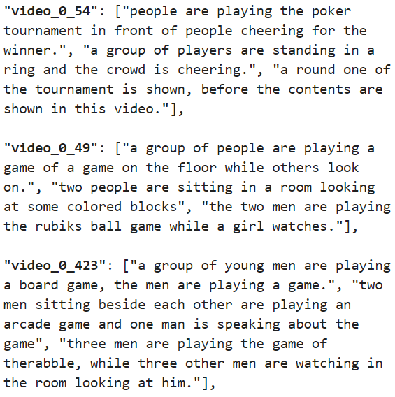
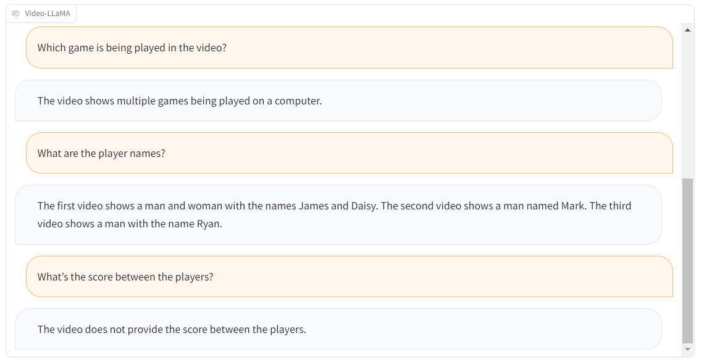
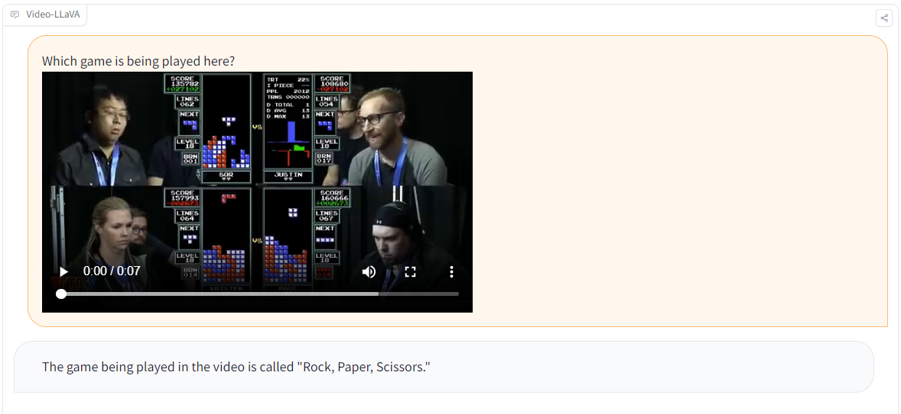

# Commentary Using Vid-LLMs

### Calvin Kranig, Unmesh Raskar, Gurudatta Patil, Ram Goutham Gunasekaran

## [GitHub Page](https://github.com/Tetris-VidLLM/commentary_vidLLM)

## [Final Project Presentation](https://docs.google.com/presentation/d/1HlOfV6bpR2wBAOudjraqju-dAw552oZy70-XxIv6_nA/edit?usp=sharing)

## 1 Introduction

### 1.1 Problem Statement
While there has been broad research in the field, there has not been
a universal video to commentary system that has been developed.
Our group plans to show that we can develop a commentary system
for professional Tetris with the hopes that it can be generalized in
the future.

### 1.2 Significance
Commentary in both real sports and video games serves to deepen
the emotional bond between fans and their favorite activities. Whether
watching a live match or playing a virtual game, commentary
enriches the viewing and playing experience, strengthening the
connection between the audience and the sport or game they en-
joy. Despite the ubiquity of this commentary, there exists many
games/sports that do not have any commentary limiting their ap-
peal and accessibility. Commentary plays a crucial role in enhancing
the experience of viewing various games and sports, aiding view-
ers in comprehending the unfolding action and enabling visually
impaired individuals to partake in events they might otherwise
miss out on. Beyond major professional events in sports and games,
the majority of recorded games and sports often lack any form
of commentary. Our group seeks to remedy this by developing a
commentary system that will be able to take in video clips and
produce commentary for the given sport/game.
Over the past couple of years there have been major break-
throughs in video and image interpretation tasks [[11]](#references)[[5]](#references). This field
has expanded into a large set of tasks including recognition, cap-
tioning, description, and question answering [[6]](#references). In a similar vein,
text to speech systems have been around for decades and there
are publicly available tools that allow for easy use [[1]](#references). Our group
plans to train a Vid-LLM model to produce textual commentary
for a video game using publicly available videos. This text will be
converted to audio using a TTS (Text-to-Speech) model to generate
audio commentary.

### 1.3 Major Objectives
To achieve this goal we completed the following major objectives:
* Create a Custom Tetris Commentary Dataset
* Create a Video to Text Commentary Pipeline Using LLMs
* Create a Text Commentary to Audio Pipeline
* Create a Full Pipeline From Video to Commentary Incorporating or Video to Text Commentary and Text Commentary to Video Pipelines

## 2 Relevant Prior Work
As discussed previously there has been a large number of works in the field of Video based Large Language Models (Vid-LLMs). Tang et. al. 2024 survey paper gives a comprehensive overview of the field as a whole [[6]](#references). Our exploration into sports video interpretation builds upon existing research. Guatam et. al. (2022) summarized soccer games using video and audio [[4]](#references). Zellers et. al. developed Merlot, a system pretrained on millions of YouTube videos, achieving state of the art results on multiple question answer datasets [[11]](#references). Recent efforts have focused on Multimodal Large Language Models (MMLMs), capable of processing both text and video [[8]](#references). A range of datasets and benchmarks are accessible for Video-Language Learning Models (Vid-LLMs), catering to tasks like captioning, question answering, grounding, and retrieval. In selecting a Vid-LLM model, options include LLM-Based Video Agents, Vid-LLM Pretraining, Vid-LLM Instruction Tuning, and Hybrid methods. For our initial methodology we opted for a Vid-LLM Pretraining model called VAST: A Vision-Audio-Subtitle-Text Omni-Modality Foundation Model and Dataset [[2]](#references).

## 3 Methodology

### 3.1 Tetris Dataset
<figure>
  
  <figcaption>Figure 1: Tetris Dataset</figcaption>
</figure>

Our group started by developing software for downloading Youtube videos along with their closed captions in order to create a custom Tetris commentary dataset. We ended up creating a full pipeline that takes in a list of video links and converts them into training data as detailed in this figure.

Youtube returns a list of captions that all have different lengths, so we decided to concatenate adjacent closed captions to produce clips that are at least 30 seconds long.

The dataset is being generated from a full playlist of the 2018 Classic Tetris World Championship. Out of the videos we are generating data for the first 11 that contain closed captions. This corresponds to roughly  524 minutes of video and just over 900 training samples.

### 3.2 Video to Commentary Pipeline
<figure>
  
  <figcaption>Figure 2: Original Commentary System</figcaption>
</figure>

Figure 2 our original complete commentary system. We take in clips from the dataset and run inference using a Vid-LLM. The textual output is then fed through a Text to Speech module that produces and mp3 that is then combined with the original clip to create a captioned clip.

In our original system we were using VAST for the Vid-LLM and Google Text-to-Speech for the TTS Module.

### 3.3 Updated Methodology
<figure>
  
  <figcaption>Figure 3: Final Commentary System</figcaption>
</figure>

Figure 3 shows our updated commentary system. It consists of 6 major steps:

1. Extract frames from video clip
2. Use block and text identifiers to extact critical information (See Figure 4)
3. Create a tabular prompt for a LLM
4. Generate textual commentary using LLM (In this case Chat GPT)
5. Pass textual commentary to a Text to Speech Model (Google Text-to-Speech) to generate audio
6. Combine the generated audio with the original clip to produce a commentated video

<figure>
  
  <figcaption>Figure 4: New Approach Focusing on Important Information</figcaption>
</figure>

  <figure>
  
  <figcaption>Figure 5: Block Detection Input and Output</figcaption>
  </figure>
  <figure>
  
  <figcaption>Figure 6: Example LLM Input</figcaption>
  </figure>

## 4 Results

### 4.1 Initial Results

  <figure>
  
  <figcaption>Figure 7: Vast Input</figcaption>
  </figure>
  <figure>
  
  <figcaption>Figure 8: VAST Output</figcaption>
  </figure>

After training VAST on our training dataset we were able to produce the output seen in Figure 8. VAST failed to detect the game being played and didn't give meaningful commentary. We tried additional Vid-LLM models and recieved similar results as seen in Figures 9 and 10. 

<figure>
  
  <figcaption>Figure 9: Video-LLaMA output</figcaption>
</figure>

<figure>
  
  <figcaption>Figure 9: Video-LLaVA output</figcaption>
</figure>

In total we tried the following Vid-LLM models:
* VAST
* Video-LLaVA
* Video-LLaMA
* Vid2Seq 
* CLIP-Captioner 
* (ViT+BERT) 

### 4.2 Explanations for Poor Initial Results
We came up with the following possible explanations for these poor results:

* Vid-LLMs are trained on a very different dataset (MSR-VTT, YouCook2)
* Tetris is quite complex for the VidLLMs to understand visually
* Instruction-prompting seemed insufficient
* The commentary dataset doesn’t always talk about what’s happening in the game. It is normal human dialog

### 4.3 Updated Methodology Results

These poor initial results prompted our updated methodology which was able to produce the following video:

<figure>
  <video width="640" height="360" controls>
  <source src="assets/output_with_commentary.mp4" type="video/mp4">
  Your browser does not support the video tag.
  </video>
  <figcaption>Video 1: Final Result Example</figcaption>
</figure>

### 5 Conclusion

Through this project we reached the conclusion that naive implementation of Vid-LLMs for Tetris commentary is not feasible. Additional image processing is required for quality commentary. This falls in line with previous work [[4]](#references) which utilized additional metadata as input to a multimodal-LLM.

Additionally the dataset we created was not optimal for training Vid-LLMs such as VAST due to the large ammount of extraneous commentary not directly related to the game being played. For future work, a more careful curation of the dataset may be able to produce better results.

## References
[1] 2023. What is Text-to-Speech? - Hugging Face — huggingface.co. https:
//huggingface.co/tasks/text-to-speech. (2023). [Accessed 20-02-2024].

[2] Sihan Chen, Handong Li, Qunbo Wang, Zijia Zhao, Mingzhen Sun, Xinxin Zhu,
and Jing Liu. 2023. VAST: A Vision-Audio-Subtitle-Text Omni-Modality Founda-
tion Model and Dataset. (2023). arXiv:cs.CV/2305.18500

[3] Sanyuan Chen, Yu Wu, Chengyi Wang, Shujie Liu, Daniel Tompkins, Zhuo Chen,
and Furu Wei. 2022. BEATs: Audio Pre-Training with Acoustic Tokenizers. (2022).
arXiv:eess.AS/2212.09058

[4] Sushant Gautam, Cise Midoglu, Saeed Shafiee Sabet, Dinesh Baniya Kshatri, and
Pål Halvorsen. 2022. Soccer Game Summarization using Audio Commentary,
Metadata, and Captions. In Proceedings of the 1st Workshop on User-Centric Nar-
rative Summarization of Long Videos (NarSUM ’22). Association for Computing
Machinery, New York, NY, USA, 13–22. https://doi.org/10.1145/3552463.3557019

[5] Alec Radford, Jong Wook Kim, Chris Hallacy, Aditya Ramesh, Gabriel Goh,
Sandhini Agarwal, Girish Sastry, Amanda Askell, Pamela Mishkin, Jack Clark,
Gretchen Krueger, and Ilya Sutskever. 2021. Learning Transferable Visual Models
From Natural Language Supervision. (2021). arXiv:cs.CV/2103.00020

[6] Yunlong Tang, Jing Bi, Siting Xu, Luchuan Song, Susan Liang, Teng Wang, Daoan Zhang, Jie An, Jingyang Lin, Rongyi Zhu, Ali Vosoughi, Chao Huang, Zeliang Zhang, Feng Zheng, Jianguo Zhang, Ping Luo, Jiebo Luo, and Chenliang Xu.2024. Video Understanding with Large Language Models: A Survey. (2024). arXiv:cs.CV/2312.17432

[7] Classic Tetris. 2018. 2018 Classic Tetris World Championship. (Dec. 2018). https:
//www.youtube.com/playlist?list=PLA3elidp12Uu_aTr7X0cWnZ7bkB2YK_jQ

[8] Zhanyu Wang, Longyue Wang, Zhen Zhao, Minghao Wu, Chenyang Lyu, Huayang Li, Deng Cai, Luping Zhou, Shuming Shi, and Zhaopeng Tu. 2023. GPT4Video: A Unified Multimodal Large Language Model for lnstruction-Followed Understanding and Safety-Aware Generation. (2023). arXiv:cs.CV/2311.16511

[9] Antoine Yang, Arsha Nagrani, Paul Hongsuck Seo, Antoine Miech, Jordi Pont-
Tuset, Ivan Laptev, Josef Sivic, and Cordelia Schmid. 2023. Vid2Seq: Large-Scale
Pretraining of a Visual Language Model for Dense Video Captioning. (2023).
arXiv:cs.CV/2302.14115

[10] Bang Yang, Tong Zhang, and Yuexian Zou. 2022. CLIP Meets Video
Captioning: Concept-Aware Representation Learning Does Matter. (2022).
arXiv:cs.CV/2111.15162

[11] Rowan Zellers, Ximing Lu, Jack Hessel, Youngjae Yu, Jae Sung Park, Jize Cao, Ali
Farhadi, and Yejin Choi. 2021. MERLOT: Multimodal Neural Script Knowledge
Models. (2021). arXiv:cs.CV/2106.02636
